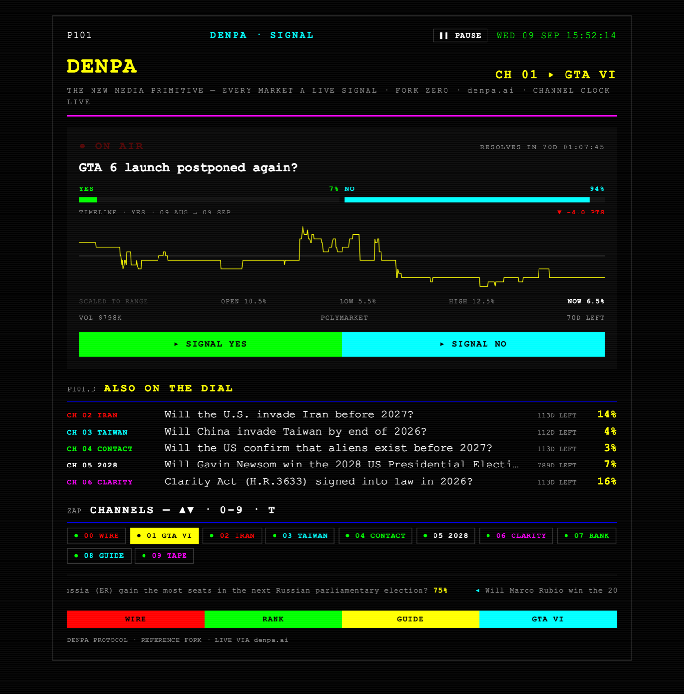
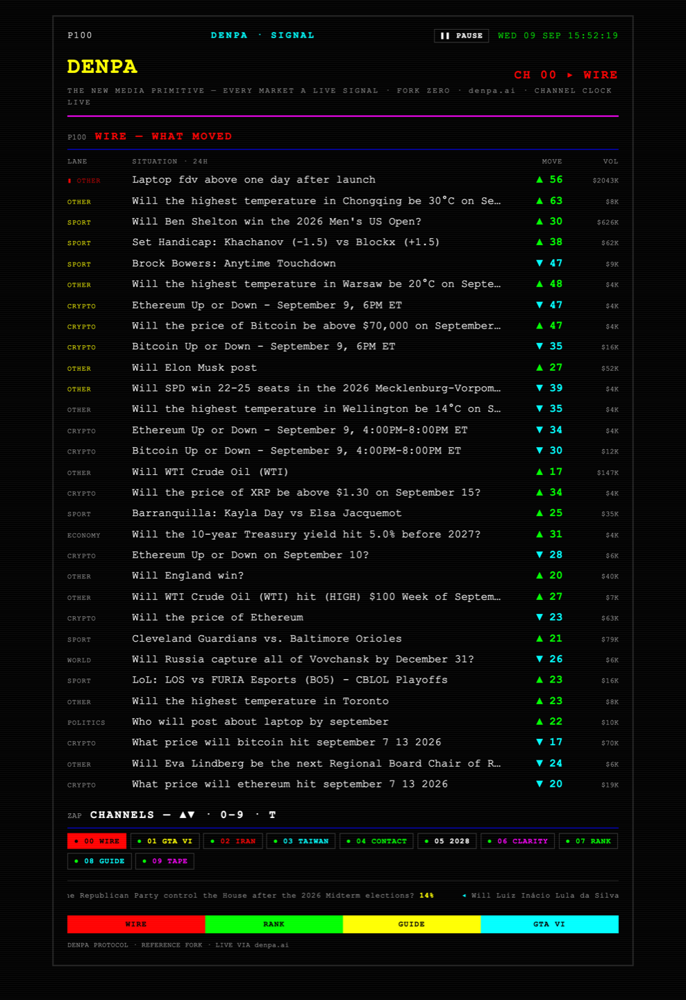
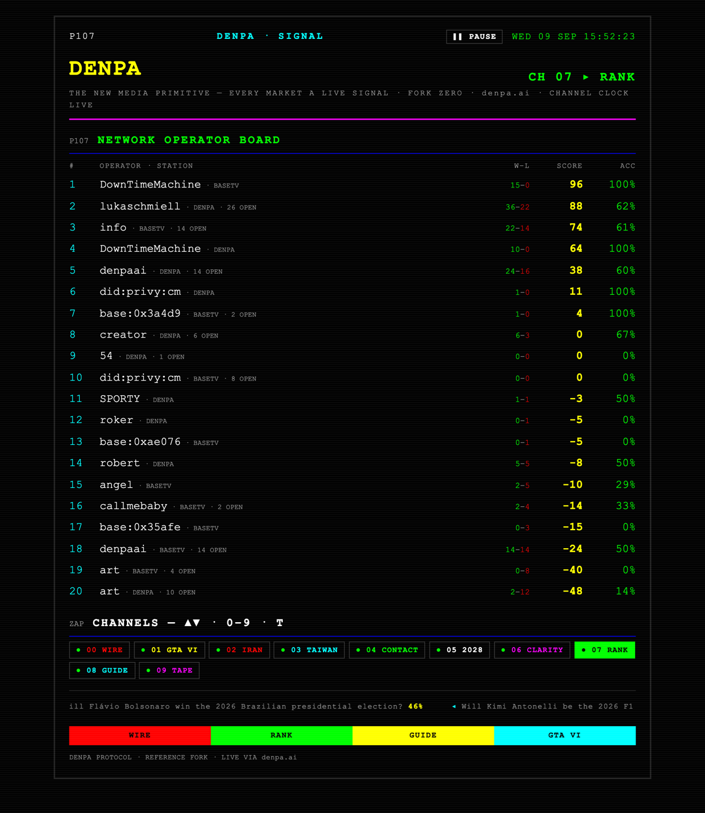
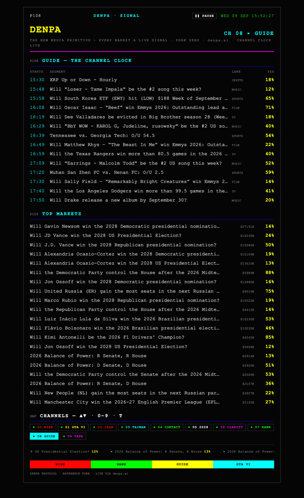
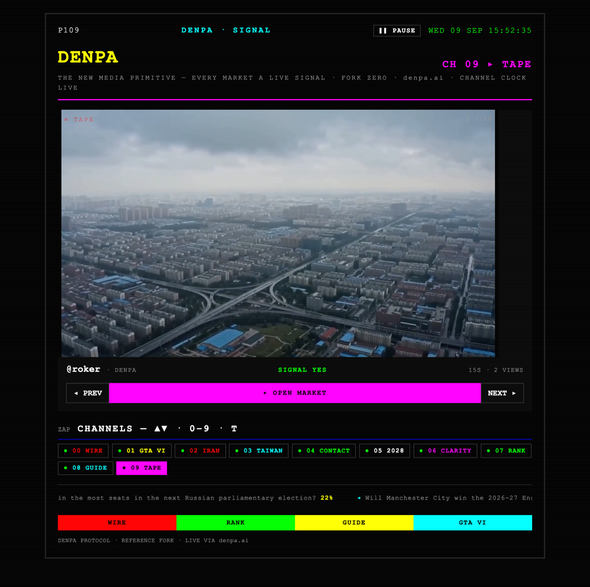

# DENPA — The New Media Primitive · Fork Zero

## Manifesto

**We are building a new media distribution machine.** Not a channel network: a
broadcast protocol where every prediction market is a live, programmable media
surface, and a market page is not a scoreboard but a transmitter. The old
machine distributed shows on a schedule; this one distributes markets by
attention — what airs is what gets discovered, and airing is a timestamped
protocol event: the clock puts a market on screen, the market moves, the move
is measured. The primitive is the **filed call**: a public YES/NO signal with a
snapshot of the market at call time, a take with a face on it, and a receipt —
resolved by reality, scored into a public field record. Watching, calling and
distributing are one gesture. Fork the surface; the distribution resolves
through denpa.ai.

> **Watch → Signal → Explain → Air → Move → Resolve → Rank → Follow**

## Fork Zero

This repo is the reference client for that primitive: a live broadcast of
market signals you can clone, reskin and ship as your own station. It owns its
surface (a static-TV broadcast set); the clock, markets, stories, tapes,
operators and field records all resolve **through denpa.ai** — there is no
second backend.

Tune with the on-screen zapper, the **0–9** number keys, **T** for the tape, or **▲ / ▼**.
**SPACE** (or **P**, or the ❚❚ PAUSE button) pauses the autocut — the now-playing market and the tape hold; the clock keeps ticking, so PLAY re-syncs to the rundown. Zapping resumes.

**Created by Lukas Chmiel and Robert Inoma.**

**Live:** https://bananaemojiii.github.io/denpa-fork-zero/ — GitHub Pages, built
from `main` on every push (`.github/workflows/pages.yml`).



*CH 01. One long-running market is the channel; its whole price arc is the
programme. Every number on screen is live from denpa.ai.*

## What denpa.ai is today (September 2026)

- **The home page is a TV.** Denpa TV rotates through the markets on air, and
  the rotation *is* the distribution policy: a live operator on a market first,
  then markets carrying takes, then what THE WIRE says moved, then segments in
  their final stretch, then the rest of the clock. What airs is what gets
  discovered.
- **The channel clock is a protocol service.** `program-clock` turns resolving
  markets into a real-time rundown (content segments with 10s bumpers between
  them, self-filling hours ahead). denpa.ai serves its own rundown at
  `/api/broadcast/program` — lanes **SPORTS · MUSIC · FILM · TV · FASHION ·
  CRYPTO** — and the same clock scoped to any station's venues and lanes at
  `/api/network/program?providers=polymarket,kalshi&categories=…`.
- **THE WIRE + SITUATIONS.** Markets ranked by how much belief *moved*, not by
  volume, and every event collapsed into one story (lanes POLITICS · CRYPTO ·
  SPORT · CULTURE · MUSIC · TECH · ECONOMY · SCIENCE · WORLD · ENTERTAINMENT).
- **THE TAPE.** The federated clip reel across the network. On a denpa.ai market
  page the tape airs the market's own takes first; the ambient reel is reranked
  to the market's question by embeddings.
- **Field records.** Every operator's public judgment history — rank, score,
  accuracy, streak, closing-line value, receipts — served by the hub at
  `/api/network/field-record/[handle]`; the operator board merges every station.
- **The Network.** denpa.ai (culture · Polymarket) · cee.news (news · Kalshi) ·
  basetv.tv (Base · Limitless) · pund.it — one protocol, with tapes, operators,
  identity and the clock federated through the denpa.ai hub. `/network` shows
  them all.
- **Keys + MCP.** `dk_` keys mint at `/developer`; `POST /api/predictions`
  files a SIGNAL. An MCP server at `denpa.ai/api/mcp` lets an agent drive an
  operator surface — push a SIGNAL to the live page and OBS overlay, bind a
  stream to a market, go live.
- **Play/pause holds the pick, never the clock** — the same rule on web, iOS
  and this fork.

## The dial

**A channel is a market, not a category.** Tune CH 1 and you get one question
with months of runway — GTA VI, Taiwan, 2028 — aired as its own channel, with
its entire recorded price history as the programme. The arc is the show. A pin
that resolves drops off the dial by itself and the band tops itself up from the
protocol's own market list, so the dial stays live with no redeploy.

| CH | Channel | Airs | Source |
|----|---------|------|--------|
| 0 | WIRE | what moved in the last 24h — one story per event, biggest mover first | `/api/situations` |
| 1–6 | the marquee band | one long-running market each: full price arc, range, runway, SIGNAL | `/api/network/market/:id` + `/api/polymarket/market-history?interval=ALL` |
| 7 | RANK | network operator board — public field records merged across every station; select an operator for their record | `/api/network/operators` → `/api/network/field-record/:handle` |
| 8 | GUIDE | the channel clock — what the protocol airs next across every lane, with real start times — then the top markets | `/api/broadcast/program` + `/api/polymarket/featured` |
| 9 | TAPE | the federated clip reel, played as a channel (HLS) | `/api/network/tapes` |

The marquee band ships with these pins, in priority order, and four reserves
promoted as the leaders resolve — edit `MARQUEE_PINS` in `src/lib/denpa.ts` to
programme your own station:

| Slot | Name | Market |
|------|------|--------|
| CH 1 | GTA VI | GTA 6 launch postponed again? |
| CH 2 | IRAN | Will the U.S. invade Iran before 2027? |
| CH 3 | TAIWAN | Will China invade Taiwan by end of 2026? |
| CH 4 | CONTACT | Will the US confirm that aliens exist before 2027? |
| CH 5 | 2028 | Will Gavin Newsom win the 2028 US Presidential Election? |
| CH 6 | CLARITY | Clarity Act (H.R.3633) signed into law in 2026? |

Auto-fill only runs when fewer than six pins survive: open markets with at least
90 days of runway, biggest first, collapsed one-per-question-family so a
128-bucket event like the 2028 nomination cannot swallow the whole dial.

A pin survives only while it is open **and** its end date is still ahead.
`status` alone is not enough — the hub reports `"open"` for markets whose end
date passed months ago, because Polymarket leaves them un-closed, and a dead pin
would otherwise sit on the dial forever showing `RESOLVING`.

A slot with no market shows the animated **NO SIGNAL** screen. Every feed
refreshes independently — 30s for the boards, 60s for the band.

## What a marquee channel airs

- **NOW PLAYING** — the market, linked to its denpa.ai page
- **YES / NO** — live split bars
- **TIMELINE** — the market's whole recorded price history, with the y-axis
  scaled to the band it actually traded in (a question that lives between 5% and
  12% draws a flat line on a 0–100 axis; the arc is the point)
- **OPEN · LOW · HIGH · NOW** — where it started, where it has been, where it is
- **RESOLVES IN** — live countdown, in days
- **ALSO ON THE DIAL** — the rest of the band, one keypress away
- **▸ SIGNAL YES / NO** — opens the denpa.ai market page to file a forecast
  (money-free; one canonical signal per the protocol)

## The other channels

| | |
|---|---|
|  |  |
| **CH 00 WIRE** — every moving market in one event collapsed into a single story, ranked by how far belief travelled. | **CH 07 RANK** — the operator board merged across every station on the network; select one for their field record. |
|  |  |
| **CH 08 GUIDE** — the channel clock: what the protocol airs next across every lane, with real start times. | **CH 09 TAPE** — the federated clip reel played as a channel, HLS, clips from every station. |

## Forks on the network

Fork Zero is the smallest one. These are the others — same protocol, different
vertical, each owning only its surface and theme:

| Fork | Vertical | Venue | What it shows |
|------|----------|-------|---------------|
| [denpa.ai](https://denpa.ai) | culture | Polymarket | the reference station — TV home, market pages, studio, receipts, MCP, the hub every other fork resolves through |
| [cee.news](https://cee.news) | news | Kalshi | a teletext carousel — P-numbered pages, THE TAPE via the denpa hub, P900 network operator board. Read-only, no DB, pure SSR |
| [basetv.tv](https://basetv.tv) | Base chain | Limitless | a sovereign fork with its own DB and auth; federates tapes and operators with denpa.ai in both directions |
| [pund.it](https://pund.it) | Robinhood universe | Kalshi | a Kalshi universe filter, `kalshi-` ids, files SIGNALs to the hub with a `dk_` key and renders the returned field record |
| **this repo** | any | whatever the hub normalizes | ~1,200 lines, three dependencies, no backend — clone, edit `MARQUEE_PINS` and the `TT` palette, ship |

The protocol stays the same; the vertical changes. Denpa Core answers *who
predicted what, when, with what context, and were they right* — a fork decides
what domain to point that at.

## Run

```bash
cp .env.example .env   # endpoints are already correct; edit only to repoint
npm install
npm run dev            # http://localhost:5173
```

## Config

`.env` (Vite) — one hub, one variable:

```
VITE_DENPA_WEB=https://denpa.ai   # markets / charts / clock / situations / tapes / operators
```

Every endpoint the fork reads sends `Access-Control-Allow-Origin: *`, so it works
from `localhost`, GitHub Pages, or any domain you deploy on.

## Protocol surfaces this fork wires (all CORS-open reads, no auth)

```
GET denpa.ai/api/network/market/ID                         # THE DIAL — any protocol id → one normalized market shape
GET denpa.ai/api/polymarket/market-history?marketId=ID&interval=ALL  # THE DIAL — the market's whole arc (1H · 24H · 7D · ALL)
GET denpa.ai/api/polymarket/markets                        # THE DIAL — auto-fill pool when a pin resolves
GET denpa.ai/api/broadcast/program?preset=default          # GUIDE — the channel clock (lanes → rundown); hot · resolving · close too
GET denpa.ai/api/polymarket/featured                       # GUIDE + ticker — heatmap tiles
GET denpa.ai/api/situations?window=24h&limit=30            # WIRE — stories of belief movement (never sum a story's deltas)
GET denpa.ai/api/network/tapes?limit=20                    # TAPE — federated clips (HLS)
GET denpa.ai/api/network/operators                         # RANK — merged operator board
GET denpa.ai/api/network/field-record/HANDLE               # RANK — an operator's public field record (+ receipt URLs)
```

Everything above is on the denpa.ai hub, on purpose. The signal leaderboard on
the API service (`api-production-…/api/v1/signals/leaderboard`) is **not**
CORS-open to arbitrary origins — its allowlist is `localhost` plus
`*.up.railway.app` — so a browser fork deployed anywhere else gets a blocked
request. RANK reads `/api/network/operators`, which is the merged board across
every station anyway. If you need the API service from a browser fork, proxy it
server-side.

Also CORS-open on the same hub, not wired here yet — the natural next steps for
a fork:

```
GET denpa.ai/api/network/program?providers=kalshi&categories=politics,news   # your station's own clock
GET denpa.ai/api/network/crowd                             # crowd consensus vs market price, per market
GET denpa.ai/api/network/pulse                             # the protocol's traction series
```

Because the dial reads `/api/network/market/:id`, a pin is not Polymarket-only:
the same endpoint normalizes `kalshi-…` and `lmt-…` ids to the same shape, so a
Kalshi or Limitless station programmes its band by changing ids, nothing else.

Filing a SIGNAL is a write: `POST denpa.ai/api/predictions` with a `dk_` key,
proxied through your own server route (not CORS-open). This fork links to the
denpa.ai market page instead. Keys: https://denpa.ai/developer. `/api/wire` is
not CORS-open either — fetch it server-side; `/api/situations` is.

denpa.ai sends `Access-Control-Allow-Origin: *` on these prefixes, so the
browser reads them cross-origin from `localhost` or any deployed fork domain.

## Structure

```
src/
  App.tsx        the broadcast set — the marquee screen, zapper, WIRE, RANK + field record, GUIDE, TAPE player, ticker
  lib/denpa.ts   typed denpa.ai client (market / marquee band / history / clock / heatmap / situations / tapes / operators / field record / CHANNELS)
  index.css      black, blocky monospace base
docs/            README screenshots
```

Only runtime dependency beyond React: `hls.js` for the TAPE channel (loaded
first; Safari falls back to native HLS).

## Extending the fork

- **Programme the dial:** edit `MARQUEE_PINS` in `src/lib/denpa.ts` — an id, a
  short channel name, an accent. Ids come from any denpa.ai market URL
  (`denpa.ai/m/668591` → `"668591"`), and `kalshi-…` / `lmt-…` ids work too.
  Add or remove dial slots in `CHANNELS` and bump `MARQUEE_SLOTS` to match.
- **Reskin:** the whole look is the `TT` palette in `App.tsx` — swap it for your
  station's theme.
- **Your own clock:** point GUIDE at
  `/api/network/program?providers=…&categories=…` for a station on other
  venues or lanes — same shape, no env var.
- **SIGNAL writes:** go through the denpa.ai signal API (key-gated) — not a second
  source of truth. Keep one canonical signal per the protocol.

## Changelog

- **0.3.0 (2026-09-09)** — **a channel is a market.** The category dial
  (SPORTS · MUSIC · FILM · TV · FASHION · CRYPTO) is retired; CH 1–6 are now the
  marquee band — one long-running market each, pinned by id and topped up
  automatically as pins resolve, read through `/api/network/market/:id` so the
  band is venue-agnostic. The chart is the market's whole arc
  (`interval=ALL`) with the y-axis scaled to its real trading range, plus
  OPEN / LOW / HIGH / NOW and days of runway. GUIDE (CH 8) inherits the channel
  clock — every lane, real start times. README gains screenshots and the forks
  on the network. The legacy `/api/broadcast/schedule` path is gone, and so is
  the API-service leaderboard: its CORS allowlist is `localhost` +
  `*.up.railway.app`, so it was a guaranteed blocked request (and a permanent
  "1 FEED OFFLINE" banner) on every fork deployed anywhere else. RANK reads the
  hub's merged operator board. The fork now needs one env var, not two.
- **0.2.3 (2026-09-09)** — hosted: GitHub Pages workflow builds `main` to
  bananaemojiii.github.io/denpa-fork-zero (Vite `base` from `BASE_PATH`).
- **0.2.2 (2026-09-09)** — RANK opens field records: selecting an operator pulls
  their public field record from the hub (`/api/network/field-record`) — rank,
  score, accuracy, W–L, open calls, streak, average CLV, recent calls with
  receipts; ESC / BACK returns to the board; no hub record → dead air + the
  station page.
- **0.2.1 (2026-09-09)** — manifesto + program view; the dial mirrors denpa.ai: CH 1–6 are the lanes the
  denpa.ai home TV airs (SPORTS · MUSIC · FILM · TV · FASHION · CRYPTO) read
  from `preset=default`; POLITICS / CULTURE / NEWS / SCIENCE retired (not on
  denpa.ai's clock); RANK / GUIDE / TAPE renumbered to 7 / 8 / 9 so the dial is
  0–9; README rewritten around the current protocol.
- **0.2.0 (2026-09-09)** — wired to the current protocol: canonical channel clock
  drives NOW PLAYING / UP NEXT; CH 0 WIRE (situations); TAPE (federated clips,
  HLS); RANK becomes the network operator board across stations; chart reads
  the documented `market-history` endpoint; play/pause; React 19, Vite 8.
- **0.1.0 (2026-06-29)** — Fork Zero: nine channels, zapper, now-playing screen,
  60-minute YES chart, EPG, leaderboard, MIT.

## Credits

Created by **Lukas Chmiel** and **Robert Inoma**. Built on the Denpa protocol.

## License

MIT — see [LICENSE](./LICENSE). Clone it, reskin it, ship your own station.

Not financial advice.
